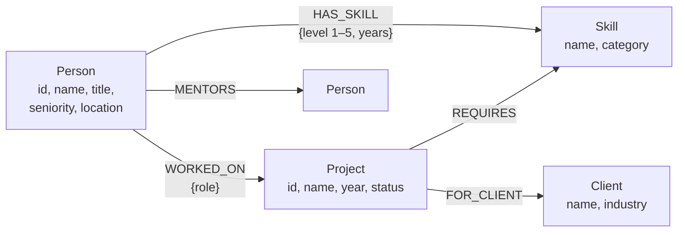

# TalentGraph

**Who knows what — and who can reach them.**

TalentGraph is an expertise and collaboration explorer for a consultancy: it maps
people, skills, projects and clients as a graph, and answers the questions flat
org charts and HR spreadsheets can't:

- *"Who are our strongest Kafka people — and how close is each one to me in the
  collaboration network?"*
- *"What's the shortest chain of shared projects connecting me to the person I
  want an intro to?"*
- *"What's the smallest team that covers Go, React, Kafka and LLM Integration?"*

Built with **Go** (official `neo4j-go-driver`) + **React** on **CognoDB**
(openCypher over Bolt) for the Wexa AI take-home assignment.

> **Hosted demo:** <https://talentgraph-6hqy.onrender.com> · **Screen recording:** _add link here_
>
> The demo runs on Render's free tier, which sleeps after ~15 minutes of
> inactivity — the first request may take ~30–60 s to wake the service.

---

## Why a graph database?

Every interesting question in this domain is a question about **relationships,
not rows**:

1. **Warm-intro paths are variable-length traversals.** "Connect Priya to Aarav
   through shared projects and mentors" is `shortestPath((a)-[:WORKED_ON|MENTORS*..8]-(b))`
   — one line of Cypher. In SQL this is a recursive CTE over a
   union of two join tables, with manual cycle detection, depth capping and
   best-path pruning; it's painful to write and worse to maintain. The path
   *itself* (people **and** the projects that connect them) is the product
   feature, and Cypher returns it as a first-class value.

2. **"Distance" is a domain concept.** The experts page ranks people by skill
   *and* by how many introductions away they are. Collaboration distance falls
   out of the graph for free; a relational schema has no natural way to express
   "2 hops" without generating and indexing all pairwise paths.

3. **The schema grows sideways.** Adding `MENTORS` edges (or `ENDORSES`,
   `REPORTS_TO`, certifications…) is additive — no migration of existing tables,
   no new join tables, and existing traversals can include the new edge type by
   changing one relationship pattern.

Where the data *is* tabular (a person's skill list, a project roster), Cypher
handles it fine too — but the three features above are the reason the graph
earns its place rather than being a fashionable choice.

## Data model



| Element | Purpose |
|---|---|
| `(:Person)` | consultants; `seniority` drives mentoring edges in the seed |
| `(:Skill)` | 27 skills across 6 categories (Languages, Frontend, Data, Cloud, AI/ML, Practice) |
| `(:Project)` | client engagements, `active` or `delivered` |
| `(:Client)` | the companies projects were delivered for |
| `[:HAS_SKILL {level, years}]` | proficiency is a property **of the relationship**, not of either node |
| `[:WORKED_ON {role}]` | the collaboration fabric — shared projects connect people |
| `[:MENTORS]` | second edge type for intro paths |
| `[:REQUIRES]`, `[:FOR_CLIENT]` | what a project needed, and who it was for |

Seed size: 48 people, 27 skills, 18 projects, 10 clients, ~450 relationships —
deterministic (fixed RNG seed), so every load produces the same graph.

## The main queries

All Cypher lives in [`internal/graph/queries.go`](internal/graph/queries.go),
and every query is **parameterised** through the official driver — no string
concatenation anywhere.

**1. Warm-intro path — variable-length shortest path (the "awkward in SQL" query):**

```cypher
MATCH (a:Person {id: $from}), (b:Person {id: $to})
MATCH path = shortestPath((a)-[:WORKED_ON|MENTORS*..8]-(b))
RETURN path
```

**2. Experts with collaboration distance — a multi-hop traversal (2+ hops):**

```cypher
MATCH (sk:Skill {name: $skill})<-[hs:HAS_SKILL]-(p:Person)
OPTIONAL MATCH (me:Person {id: $from})
OPTIONAL MATCH dist = shortestPath((me)-[:WORKED_ON*..6]-(p))
RETURN p, hs.level AS level, hs.years AS years,
       CASE WHEN dist IS NULL THEN -1 ELSE length(dist) / 2 END AS distance
ORDER BY level DESC, years DESC
```

Each `person –WORKED_ON→ project ←WORKED_ON– person` step is two relationship
hops, so "2 intros away" is a 4-hop traversal.

**3. Skill adjacency — co-occurrence through a shared neighbour:**

```cypher
MATCH (sk:Skill {name: $skill})<-[:HAS_SKILL]-(p:Person)-[:HAS_SKILL]->(other:Skill)
WHERE other <> sk
RETURN other.name, count(p) AS overlap ORDER BY overlap DESC LIMIT 10
```

**4. Team builder** — one `UNWIND $skills` query fetches every qualified person
per required skill; a small, readable greedy set-cover in Go
([`TeamPlan`](internal/graph/queries.go)) assembles the smallest covering team.

## Project structure

```
cmd/server/        entrypoint: HTTP server + static frontend
cmd/seed/          entrypoint: wipe & load the demo dataset
internal/config/   env-var configuration (fails fast if secrets missing)
internal/graph/    driver wrapper + ALL Cypher (parameterised) + ErrUnavailable
internal/api/      HTTP handlers, JSON helpers, 503 mapping, SPA static serving
internal/seed/     deterministic dataset generator + batched UNWIND loader
frontend/          React + Vite + TypeScript app (no UI framework — hand-styled)
```

Error handling: connectivity failures are tagged `graph.ErrUnavailable` and
mapped to **HTTP 503**; the frontend shows a dedicated "database unreachable"
state with a retry button, distinct from generic errors and empty states.

## Security (OWASP-aligned)

| Control | Implementation |
|---|---|
| Injection | Every query is parameterised via the official driver — no string-built Cypher anywhere (OWASP A03) |
| Security headers | Strict `Content-Security-Policy` (self-only), `X-Content-Type-Options`, `X-Frame-Options: DENY`, `Referrer-Policy: no-referrer`, `Permissions-Policy`, COOP/CORP, HSTS behind TLS (A05) |
| Secrets | Env-vars only; `.env` gitignored; Docker image contains no credentials (A02/A05) |
| Rate limiting | Per-IP token bucket (burst 60, 2 req/s sustained) → `429 Retry-After`, proxy-aware via `X-Forwarded-For` (A04) |
| Input validation | Length caps on all query params and body fields; team-plan body limited to 10 skills and 8 KiB (A03) |
| Resource exhaustion | Request bodies capped, per-request 15 s timeout, server read-header timeout, driver connection pool capped (A04) |
| Error hygiene | Internal errors are logged server-side; clients get generic messages — no stack traces or query text leak (A09) |
| Container | Multi-stage build, non-root user, static binary, minimal Alpine base (A08) |

## Performance & scaling

- **Response cache with request coalescing**: read-heavy endpoints sit behind a
  60 s TTL cache; concurrent misses for the same key collapse into a single
  database call (`singleflight`), so a traffic spike produces one query, not a
  stampede against the 0.5 vCPU free-tier instance. Only 200s are cached —
  errors always reflect live state. Check the `X-Cache: HIT|MISS` header.
- **Rate limiting** keeps any single client from monopolising the database.
- **Immutable asset caching**: Vite emits content-hashed filenames, served with
  `Cache-Control: immutable, max-age=1y`; `index.html` is `no-cache`.
- **Bounded everything**: connection pool (50 of the 200-connection budget),
  connection-acquisition timeout, transaction retry time (5 s), per-request
  deadline (15 s) — under overload the API degrades with fast, honest errors
  instead of queueing forever.
- **Stateless server**: all state lives in the database (and the cache is
  per-instance, short-TTL), so horizontal scaling is "run more replicas behind
  the load balancer".
- Measured locally: 150 concurrent requests → 64 served (within budget),
  86 politely refused with `429`, zero errors, zero database overload.

## UI

Single design language ("network command center") with **dark and light themes**
— toggle in the nav, persisted, defaulting to the OS preference. The home page
renders the entire collaboration fabric as a **live force-directed network**
(hand-rolled canvas physics, no chart library): hover highlights a node's
neighbourhood, clicking a person opens their profile. Person and skill pickers
are searchable comboboxes with keyboard navigation. Every page has explicit
loading, empty, error and database-offline states, and the app respects
`prefers-reduced-motion`.

## Setup

### 1. Create a CognoDB instance

1. Sign up at <https://console.cognodb.com/signup> (free tier, no credit card).
2. Create a free **c0** instance and pick a region (provisions in ~1 minute).
3. Copy the connection URI (`bolt+s://<instance-id>.databases.cognodb.cloud`)
   and the generated password for user `cognodb` — **it is shown exactly once**.

### 2. Configure & seed

```bash
cp .env.example .env        # fill in NEO4J_URI / NEO4J_PASSWORD
set -a; source .env; set +a

go run ./cmd/seed           # wipes the DB and loads the demo dataset
```

### 3. Run

```bash
make build                  # builds frontend + binaries
go run ./cmd/server         # serves app + API on http://localhost:8080
```

For frontend development with hot reload: `make dev` (Vite on :5173, proxying
`/api` to :8080).

### Local database (optional)

No CognoDB instance handy? Any Bolt-speaking graph DB works:

```bash
docker run -d --name talentgraph-neo4j -p 7687:7687 \
  -e NEO4J_AUTH=neo4j/localtest123 neo4j:5
export NEO4J_URI=bolt://localhost:7687 NEO4J_USER=neo4j NEO4J_PASSWORD=localtest123
```

### Deploy (Render / Railway / Fly)

The included multi-stage `Dockerfile` builds the frontend, compiles the Go
server and produces a small Alpine image. Set `NEO4J_URI`, `NEO4J_USER` and
`NEO4J_PASSWORD` in your host's environment settings — nothing secret is baked
into the image or the repo.

## API

| Endpoint | Description |
|---|---|
| `GET /api/health` | liveness + DB reachability |
| `GET /api/stats` | node/relationship counts |
| `GET /api/people?q=` | directory / search |
| `GET /api/people/{id}` | full profile: skills, projects, collaborators, mentoring |
| `GET /api/experts?skill=&from=` | ranked experts, with collaboration distance from `from` |
| `GET /api/skills` | all skills with holder counts |
| `GET /api/skills/adjacent?skill=` | skills that co-occur with a skill |
| `GET /api/path?from=&to=` | shortest intro path between two people |
| `POST /api/team-plan` | `{"skills": [...]}` → smallest covering team |

## Screenshots

_Add screenshots of the home page, experts view, intro path and team builder here._
